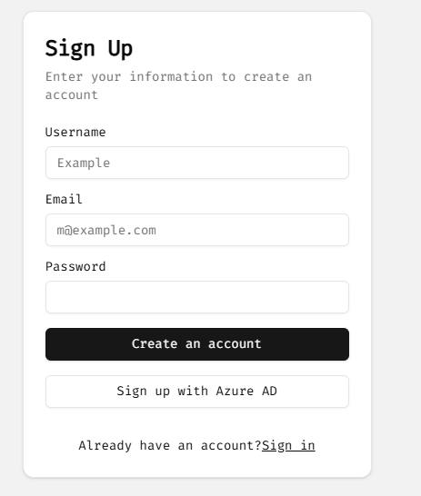
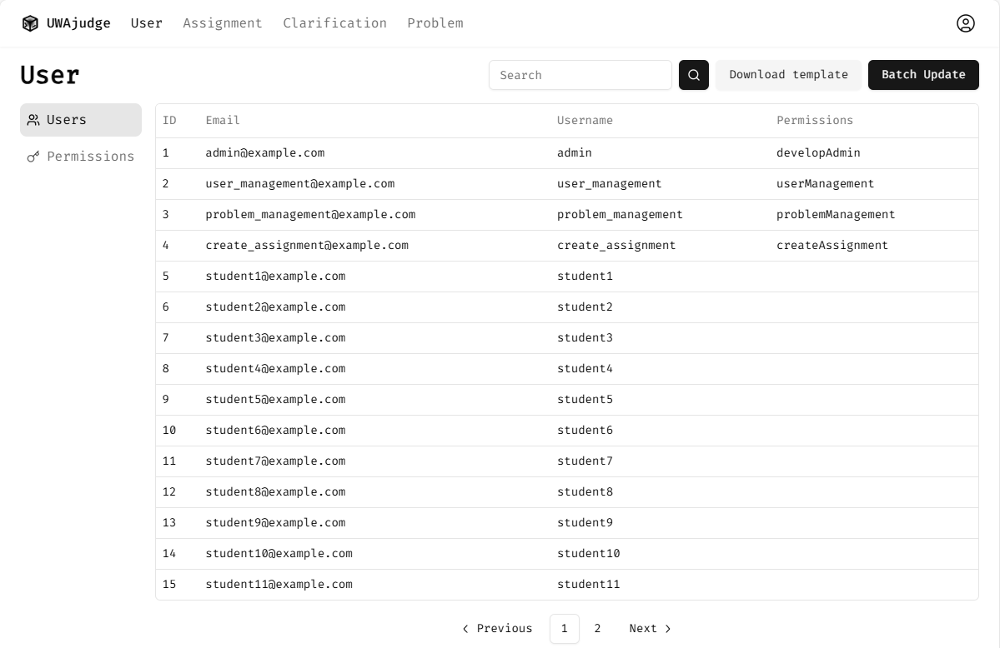
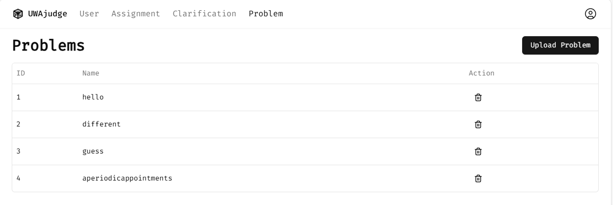
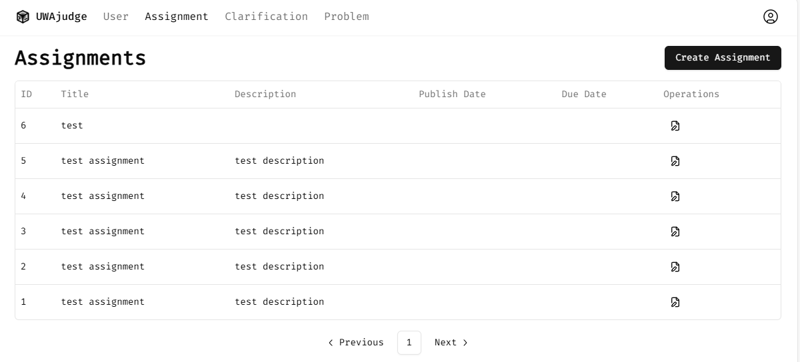
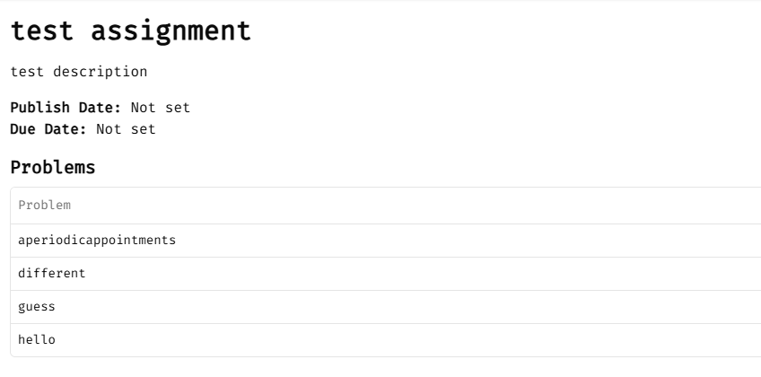
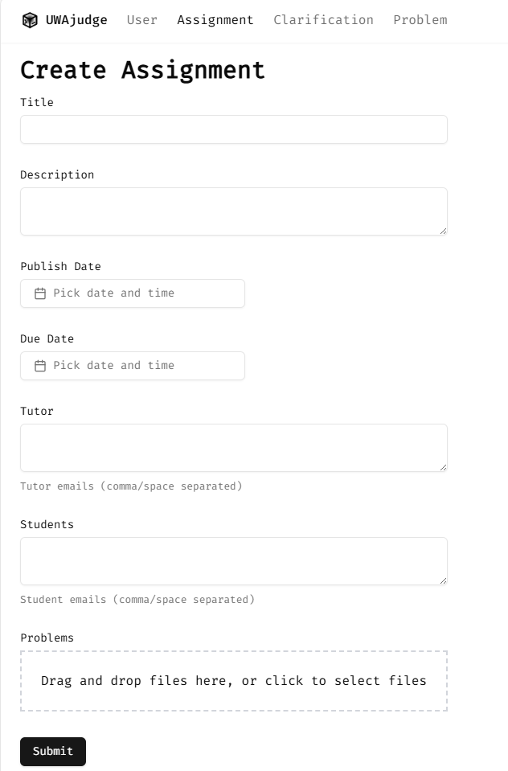
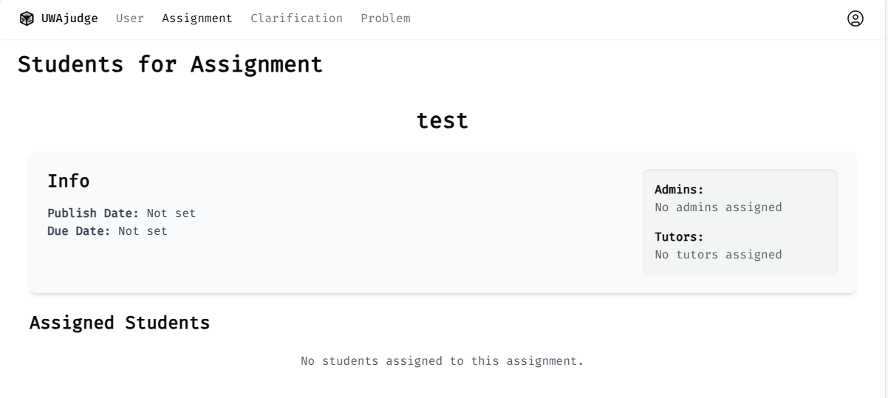
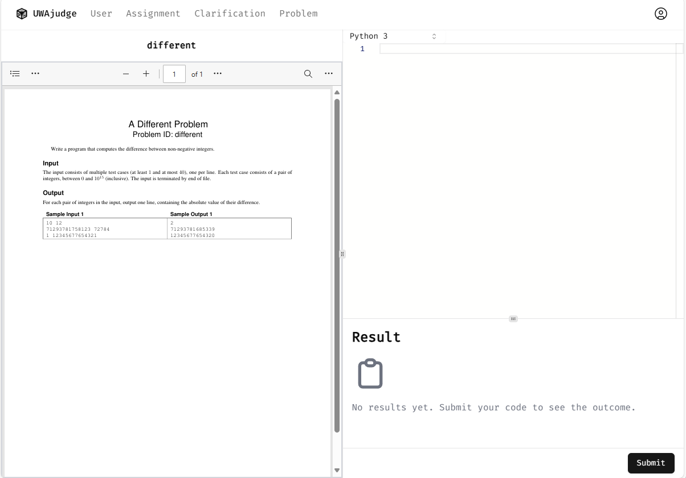

# USER MANUAL: UWA Judge

Prepared by: [Tommy Liu](https://github.com/tommyjqliu)

Date: 2024-10-17

## 1. INTRODUCTION

### 1.1 Scope
The manual provide a basic guide to the system. Including the system capabilities, description of system functions, operating instructions and error handling. Detailed developer guide is also provided for those who are interested in modifying the system.

### 1.2 Organization
System capabilities, description of system functions, operating instructions and error handling are described in Sections 2, 3, 4 and 5. Detailed developer guide is provided in Section 6.

### 1.3 Points of Contact
Please contact [Tommy Liu](mailto:tommyjqliu@outlook.com) in case of any questions.

### 1.4 Project References
The system is mainly inspired by [DOMjudge](https://github.com/DOMjudge/domjudge). We take judgehost from [DOMjudge](https://github.com/DOMjudge/domjudge) and modify it to fit our needs.


## 2. SYSTEM CAPABILITIES

### 2.1 Purpose
UWA Judge is a modern online judge system designed for teaching purposes. Teachers can post problems and assignments, and students can submit their solutions and compete with others.
### 2.2 General Description
At the moment, UWA Judge mainly contains the following features:

- User Management
    - Create and manage user accounts
    - Assign permissions
- Problem Mangement
    - Upload and parse problem in [Kattis Format](https://github.com/Kattis/problemtools)
    - Auto-generate Problem Statement PDF
- Assignment Mangement
    - Create and publish Assignments
    - Create and manage Clarifications
    - Assess submissions
- Code Editor
    - Write code with syntax highlighting
    - Multiple language support
    - Real-time code judging


## 3. DESCRIPTION OF SYSTEM FUNCTIONS

### 3.1 User Management
This section describes the user management features of UWA Judge.

**Login**

By default, any user can sign up for an account. There are two ways to sign up:
1. Sign up with email and password
2. Sign up with Azure AD



Sign in is similar to sign up. When use Azure AD, the userPrincipalName of the user are assumed to be the email of the user. In other parts of the system, the email is used to identify the user. The idea here is that user only have to prove the email belongs to them.

**User Management**



User that holds `userManagement` permission can access to the user management page. Here, user can check and configure other users' permissions. A batch update function is also provided for conveniece. User can use a CSV file to update the permissions of multiple users at once.

Note that there is no need to create account in normal circumstance. When operations are performed with unexisting user email (e.g. set up a new assignment), the system will create a placaholder account for that user email. Then account is then turely activated after the first successful login.

### 3.2 Problem Management
User that holds `problemManagement` permission can access to the problem management page. Here, user can upload problem in [Kattis Problemtools](https://github.com/Kattis/problemtools) format and the system will automatically generate the problem statement in PDF format. Here also list all existing problems in the system.



By clicking on problem name, one can assess code editor of the problem and test the problem.

### 3.3 Assignment Management

**Assignment General**

User can see all assignments related to themself. 



By clicking on assignment name, one can access the assignment deatil page. Here, user can see the problemset of the assignment. Similar to problem management, one can also access code editor to test the problem.



**Create Assignment**

User that holds `createAssignment` permission can create a new assignment.



**Assess Assignment**

User are admin or tutor to the assignment can assess the assignment.



### 3.4 Code Editor
In code editor, user can write code and test the problem. The code will be judged after submission.



## 4. OPERATING INSTRUCTIONS
### 4.1 Initiate Operation

**Prerequisite**
- Docker
- Azure AD
- SMTP server
- HTTPS certificate

To install the system please copy `docker-compose.prod.yml`, `nginx.conf` and `example.env` from the [repository](https://github.com/tommyjqliu/uwa-judge) to the root directory of the system. Then rename `example.env` to `.env` and fill in the environment variables. To enable all features, Azure AD, SMTP server and https certificate are required.

**Install**

Rename `docker-compose.prod.yml` to `docker-compose.yml` and run the following command to start the system.
```bash
docker compose up -d
```
The system is now running with a empty database. We can initialize the database by running the following command.
```bash
docker compose exec webapp sh /app/scripts/prod-reset-db.sh
```
Now the system is ready to use.

### 4.2 Maintain Operation
If any thing goes wrong, one can reset the database by running the following command.
```bash
docker compose exec webapp sh /app/scripts/prod-reset-db.sh
```

### 4.3 Terminate and Restart Operations
The system can be terminated by running the following command.
```bash
docker compose down
```
The system can be restarted by running the following command.
```bash
docker compose restart
```
Please refer to [docker compose](https://docs.docker.com/compose/) for more information.

## 5. ERROR HANDLING
In case of any errors or issues, please first try restart the system. If the issue persists, please check logs of the system. And contact the [Tommy Liu](mailto:tommyjqliu@outlook.com) for further assistance.
```bash
docker compose logs
```

## 6. DEVELOPER GUIDE
**Prerequisite**
- Docker
- Node.js

**Install**

Download source code from github.
```bash
git clone https://github.com/tommyjqliu/uwa-judge.git
```

Rename `.env.example` to `.env` and fill in the environment variables. Similar to production env, Azure AD, SMTP server and https certificate are required to enable all features.

**Run**

In root directory of the project, run the following command to start the system. Now the system is running in development mode. Open `http://localhost:3000` in browser to access the system.

```bash
npm run docker-dev-up
```
**Project Structure**

The project mainly contains three submodules: `webapp`, `judgehost` and `problemtools`. `webapp` is a next.js project contains most of the features of the system. `judgehost` is a modified version of [DOMjudge](https://github.com/DOMjudge/domjudge) judgehost. `problemtools` is a continer that contains problemtools and a webserver to generate problem statement in PDF format.


**Modify Webapp**

To modify webapp, one can edit the code and the changes will be reflected in the browser after a refresh.

**Modify judgehost/problemtools**

To modify judgehost or problemtools, you need to build the image locally to see the changes.

```bash
npm run build-judgehost
npm run build-problemtools
```
After build restart the system to see the changes.
```bash
npm run docker-dev-up
```

**Build and Deploy**

To build all submodules, run the following command.
```bash
npm run build-webapp
npm run build-judgehost
npm run build-problemtools
```

Then one can either push the images to docker hub or run the system locally.

After setting docker hub related, one can push the images to docker hub by running the following command.
```bash
npm run push-webapp
npm run push-judgehost
npm run push-problemtools
```

**Reference**
- [DOMjudge](https://github.com/DOMjudge/domjudge)
- [Kattis Problemtools](https://github.com/Kattis/problemtools)
- [Next.js](https://nextjs.org/)
- [React](https://reactjs.org/)
- [Docker](https://www.docker.com/)
- [Docker Compose](https://docs.docker.com/compose/)
- [Rabbit MQ](https://www.rabbitmq.com/)